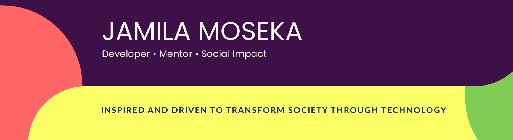

<!--   -->
<!--## Hi there 👋 -->

<!--  -->

 ### 👩‍💻 About me
 Hi there, I'm Mila and I love to create visually captivating and functional websites that meet users and business needs.  With a keen eye for detail and a love for clean code, I strive to deliver exceptional user experiences through my work.
 
💻   I'm well-versed in ReactJS, Tailwindcss, Bootstrap, SASS, and HTML, and have hands-on experience with UI design tools like Figma, leveraging these technologies. I enjoy transforming designs into responsive and intuitive web interfaces that captivate users.

### What am I up to? 

🌱 Currently, I'm embarking on an exciting journey into the world of full-stack development. I'm diving deep into the realm of Node.js, Express, and MongoDB, as I believe they form the foundation of creating robust and scalable web applications.

💡 As I progress further, my sights are set on the MERN stack (MongoDB, Express, React, and Node.js). By combining the power of these technologies, I'll be able to develop end-to-end web applications with stunning user interfaces and performant backend architecture.

📚 Learning is a continuous process, and I'm thrilled to be on this journey of growth and exploration. Join me as I expand my skills in full-stack development and bring ideas to life through innovative and user-centric solutions.

### Connect with me
<a>jamylam3@gmail.com</a>

 

 

### 🎨 Skills

- **Frontend:** JavaScript (ES6+), React/Redux, Tailwindcss, Bootstrap, Scss

- **Tools:** Figma, Git, Webpack

 ### 🛠 Tools and Framework

Name | Badges
--- | --- 
**Languages**  |    
**Frameworks** |    
**Tools** |   
**Linters**  |   

 

### 👔 Soft skills

✅ Work collaboratively in a team

✅ Meet tight deadlines

✅ Good communication skills

<!-- ### 📘Feel free to read some of my blogs -->
<!-- <a href="https://mila.hashnode.dev">Hashnode </a> -->

<!-- 

<h4> Connect with me: </h4>

 passionate and determined Frontend web developer seeking to use proven skills in front-web development to meet business needs. 
  &nbsp; 

<!-- BLOG-POST-LIST:END -->

 ## 📈 Github Stats
  

<a href="https://github.com/SubhamRaoniar28/github-readme-stats"> &nbsp;</a>

 

   
 
  

<!-- **jmoseka/jmoseka** is a ✨ _special_ ✨ repository because its `README.md` (this file) appears on your GitHub profile.

Here are some ideas to get you started:

- 🔭 I’m currently working C projects
- 🌱 I’m currently learning C programming language
- 👯 I’m looking to collaborate on C programming, CSS and html
- 🤔 I’m looking for help with C programming language, Python, Front End Development Technologies
- 💬 Ask me about C programming
- 📫 How to reach me: ...
- 😄 Pronouns: ...
- ⚡ Fun fact: ...
-->
